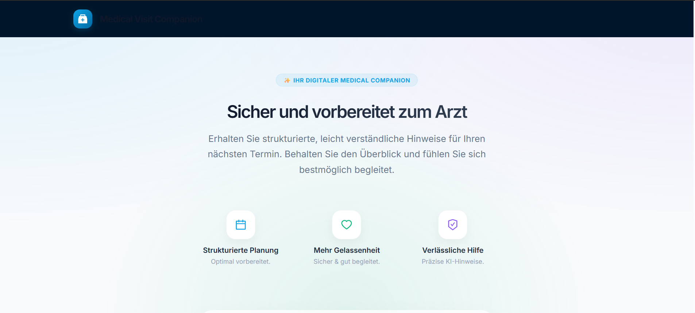
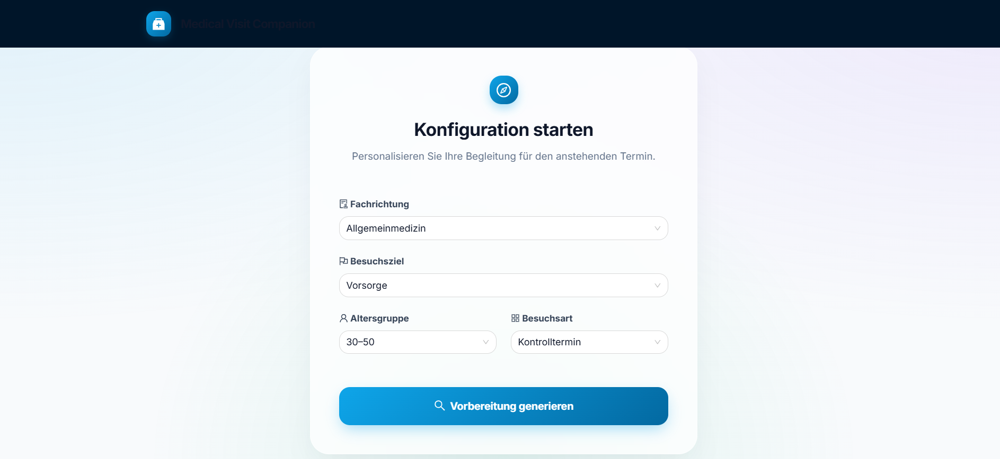
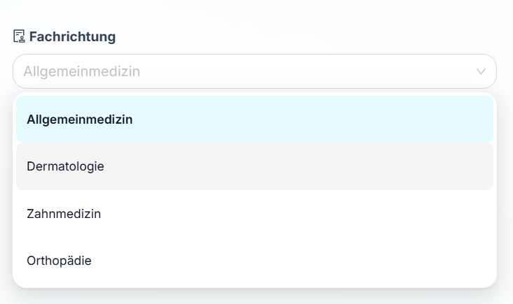
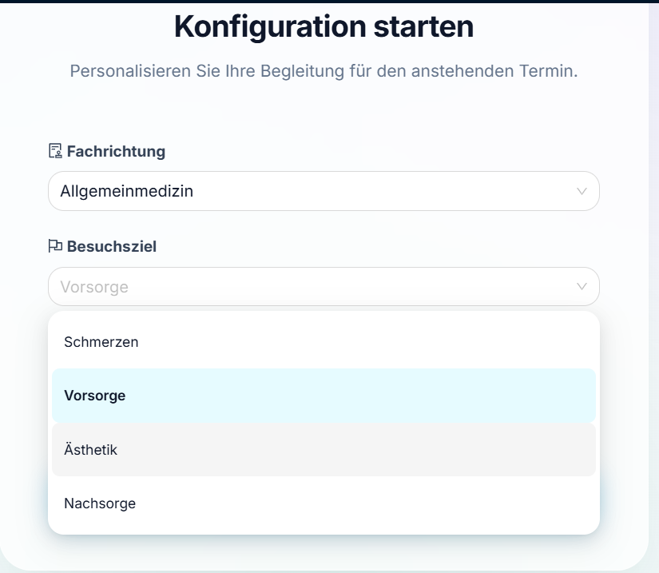
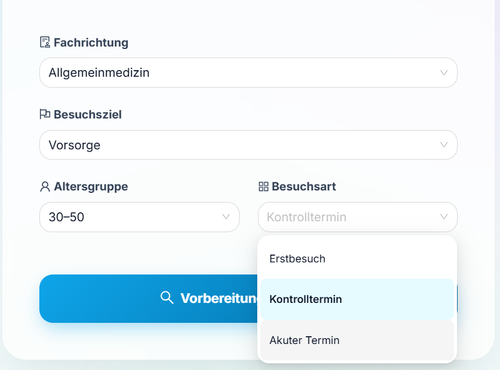
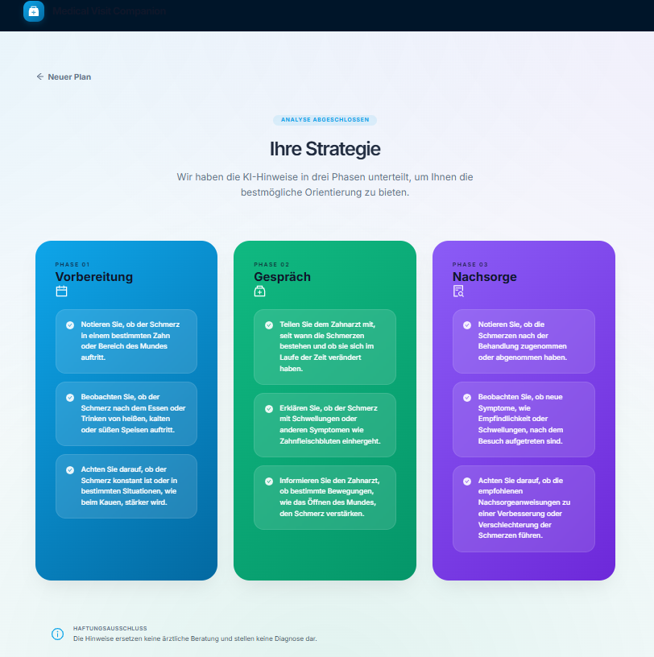

# 🩺 Medical Visit Advisor

**Medical Visit Advisor** ist eine Full-Stack-Webanwendung, die Nutzer:innen dabei unterstützt, sich strukturiert auf einen Arztbesuch vorzubereiten, das Gespräch während des Termins bewusster zu führen und Hinweise für die Nachbereitung zu erhalten.

Die Anwendung nutzt **Spring Boot, Spring AI und OpenAI**, um **kontextbezogene, strukturierte und verantwortungsvolle medizinische Hinweise** zu generieren.  
⚠️ Die Anwendung stellt **keine Diagnosen**, **keine Therapien** und **keine medizinischen Entscheidungen** bereit.

---

## 🎯 Ziel des Projekts

Viele Patient:innen fühlen sich bei Arztbesuchen unsicher oder unvorbereitet.  
Medical Visit Advisor hilft dabei:

- relevante Beobachtungen strukturiert festzuhalten
- wichtige Aspekte nicht zu vergessen
- das Arztgespräch gezielter zu führen
- Nachsorgehinweise besser einzuordnen

Der Fokus liegt bewusst auf **Orientierung und Vorbereitung**, nicht auf medizinischer Bewertung.

---

## ✨ Hauptfunktionen

- Auswahl von:
  - medizinischer Fachrichtung
  - Besuchsziel (z. B. Schmerzen, Vorsorge)
  - Altersgruppe
  - Besuchsart (akut, Erstbesuch, Kontrolle)
- KI-gestützte Generierung von Hinweisen:
  - **vor dem Arztbesuch**
  - **während des Arztbesuchs**
  - **nach dem Arztbesuchs**
- Strukturierte Ausgabe als **Checklisten**
- Frontend vollständig auf **Deutsch**
- Klare medizinische **Abgrenzung durch Disclaimer**

---
## 🏗️ Architektur

### Backend
- Java 21
- Spring Boot 3
- Spring Web
- Spring Validation
- Spring AI (OpenAI)
- REST API

### Frontend
- React
- TypeScript
- Ant Design
- Ruhiges Medical-UI
- Card- & Checklisten-Layout

## 🖼️ Demo & Screenshots

> 📌 **Hier können Screenshots oder Demo-Bilder eingefügt werden**

